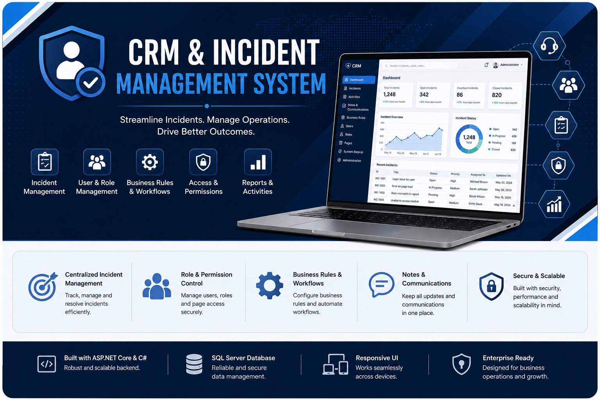

# CRM & Incident Management System

A business-focused CRM and incident management web application designed to manage incidents, business rules, users, roles, permissions, and administrative workflows through a structured enterprise-style interface.

> **Portfolio Project:** Enterprise business application development, enhancement, UI implementation, workflow management, and database-driven functionality.

---

## 📋 Project at a Glance

| Category | Details |
|---|---|
| **Project Type** | Enterprise CRM & Incident Management Application |
| **Domain** | CRM / Incident & Business Operations |
| **Development** | Application Development & Enhancement |
| **Backend** | ASP.NET Core / .NET, C# |
| **Frontend** | HTML5, CSS3, JavaScript, Bootstrap |
| **Database** | Microsoft SQL Server |
| **API** | REST APIs |
| **Key Areas** | Incident Management, Business Rules, Users, Roles, Pages, Permissions & System Administration |

## 📌 Project Overview

This application is a CRM and incident management platform designed to support business operations and internal workflows.

The system provides dedicated modules for incident management, incident activities, notes and communications, business rules, user management, role management, page permissions, and system configuration.

The application demonstrates experience working with complex business applications that require structured workflows, configurable permissions, administrative controls, and data-driven interfaces.

---

## 🚀 Key Features

### Incident Management

- Incident listing and management
- Incident creation
- Incident activities
- Incident notes and communications
- Incident search and filtering
- Incident-related workflows
- DataGrid-based record management

### Dashboard & Business Operations

- Application dashboard
- Business rule management
- Business rule configuration
- Search and filtering
- Modal and popup-based workflows

### User & Access Management

- User listing
- User management
- User information management
- Role management
- Page management
- Access and permission configuration

### System Administration

- System StepUp management
- Application configuration
- Administrative settings
- Configurable business rules
- Page and role configuration

---

## 🛠️ Technology Stack

### Backend

- ASP.NET Core / .NET
- C#
- REST APIs

### Frontend

- HTML5
- CSS3
- JavaScript
- Bootstrap
- Responsive web UI

### Database

- Microsoft SQL Server

### Development Tools

- Visual Studio
- Git
- GitHub

---

## 💻 My Contribution

I worked on the development and enhancement of this enterprise CRM and incident management application.

### Application Development

- Developed and enhanced application modules based on business requirements.
- Implemented new functionality and improved existing application features.
- Worked on complex business workflows and data-driven functionality.
- Integrated frontend functionality with backend services and APIs.

### UI & Frontend

- Developed and enhanced enterprise-style user interfaces.
- Worked with forms, DataGrids, filters, modals, popups, and management screens.
- Improved usability and consistency across application modules.
- Implemented frontend interactions and validation.
- Enhanced existing pages based on functional and UI requirements.

### Incident Management

- Worked on incident listing and management functionality.
- Implemented incident creation and related workflows.
- Worked with incident activities.
- Worked with incident notes and communications.
- Implemented search, filtering, and data management functionality.

### Administration & Security

- Worked on user management functionality.
- Worked with role and page management.
- Implemented and enhanced permission-related functionality.
- Worked with configurable business rules and system administration features.

### Database & Backend

- Worked with ASP.NET Core and C# backend functionality.
- Worked with SQL Server database operations.
- Developed and integrated API-based functionality.
- Debugged and improved backend and database-driven application features.

---

## 📸 Application Screenshots

### Login

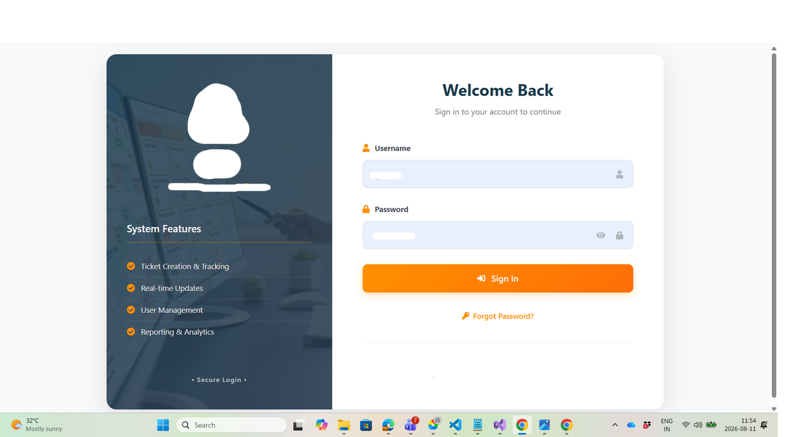

### Dashboard

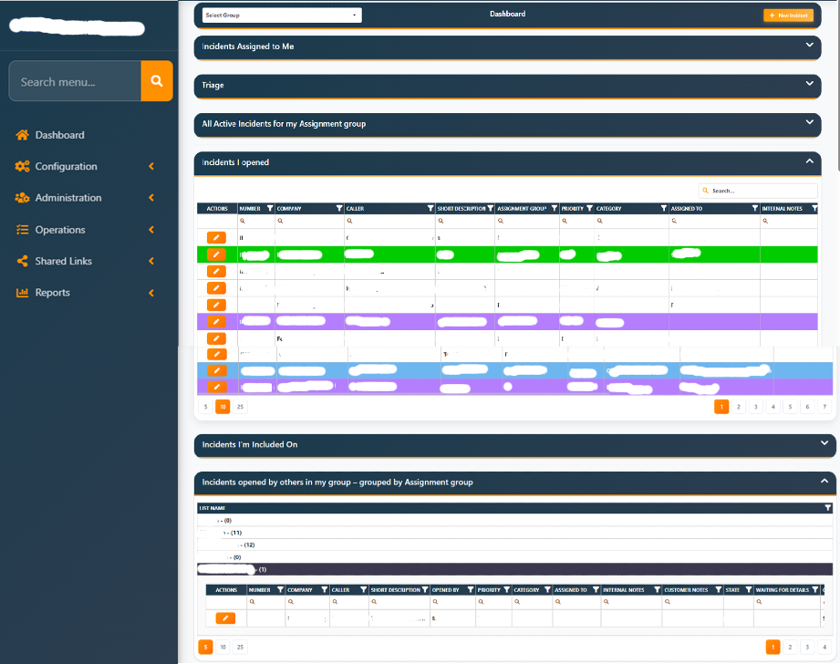

### Incident List

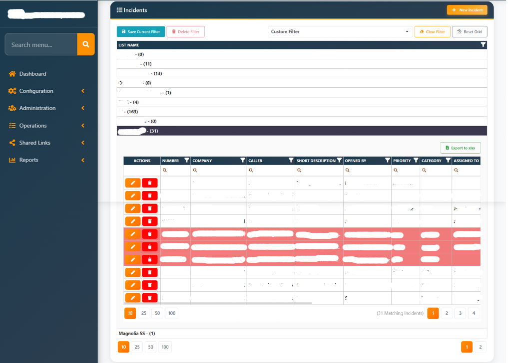

### Add Incident

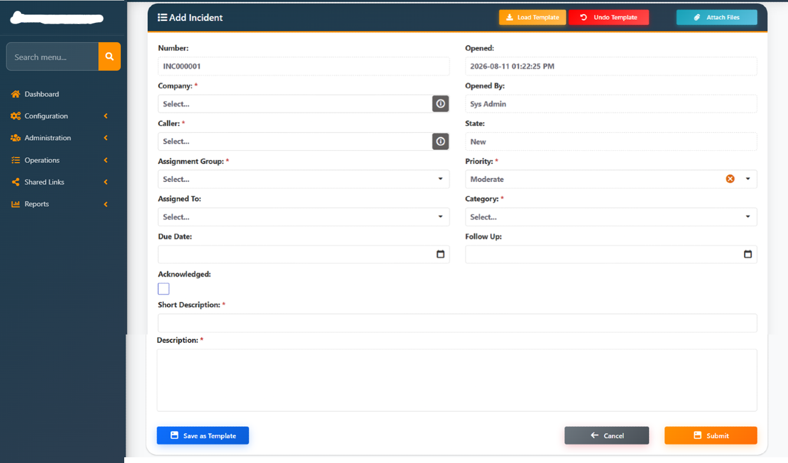

### Popup

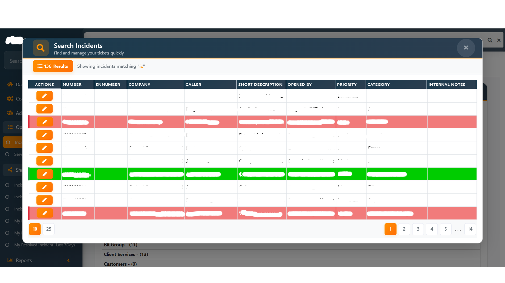

### Modal

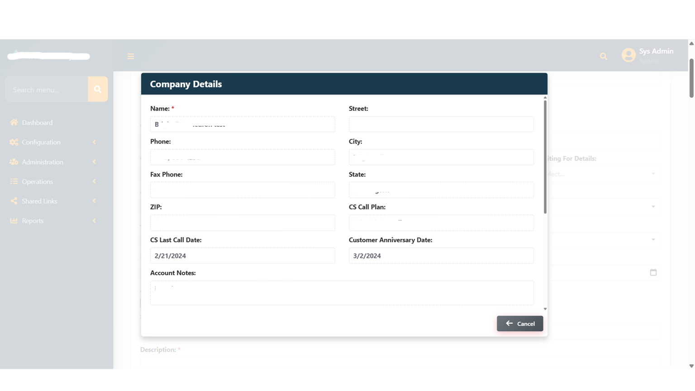

### Business Rule List

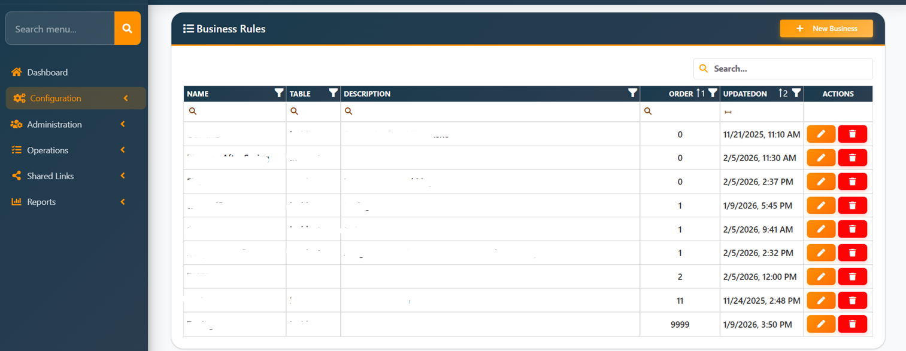

### Edit Business Rule

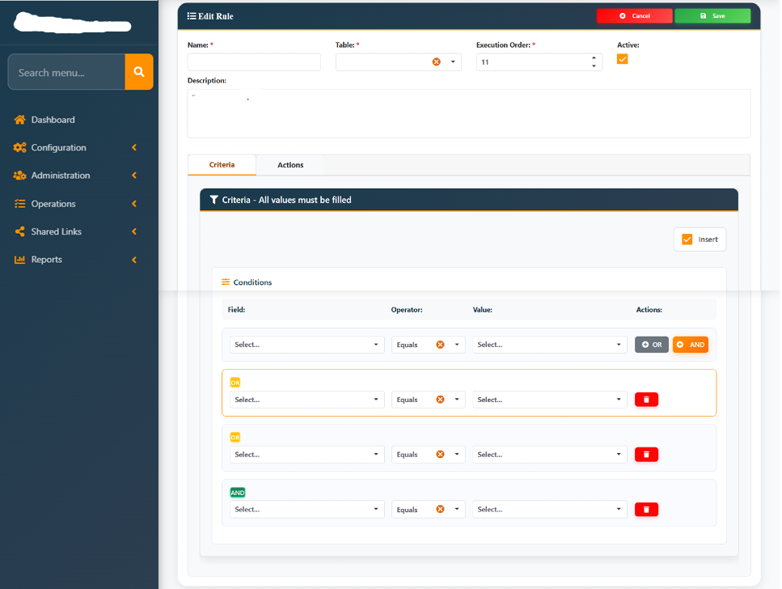

### Role Manager

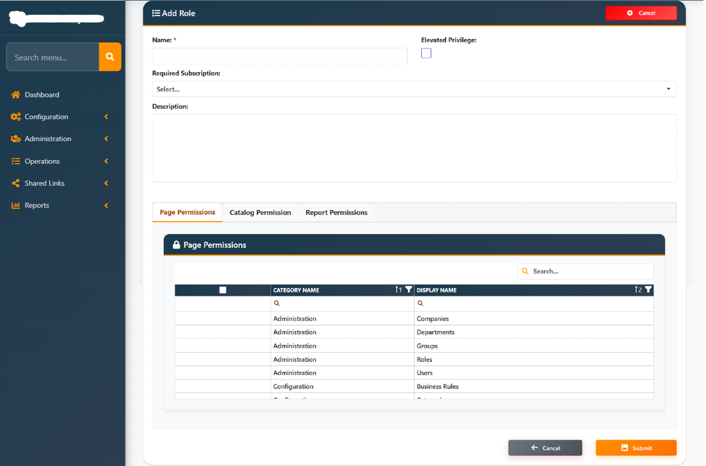

### Pages Manager

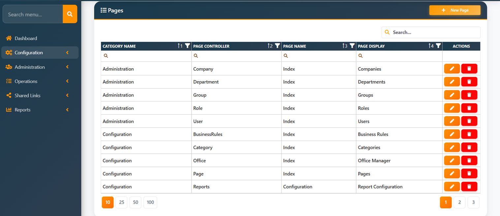

### Personal Information

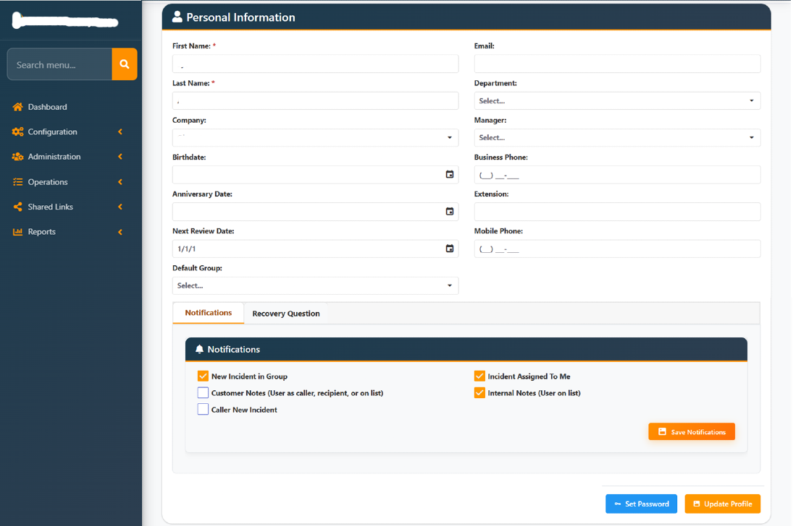

### System StepUp Manager

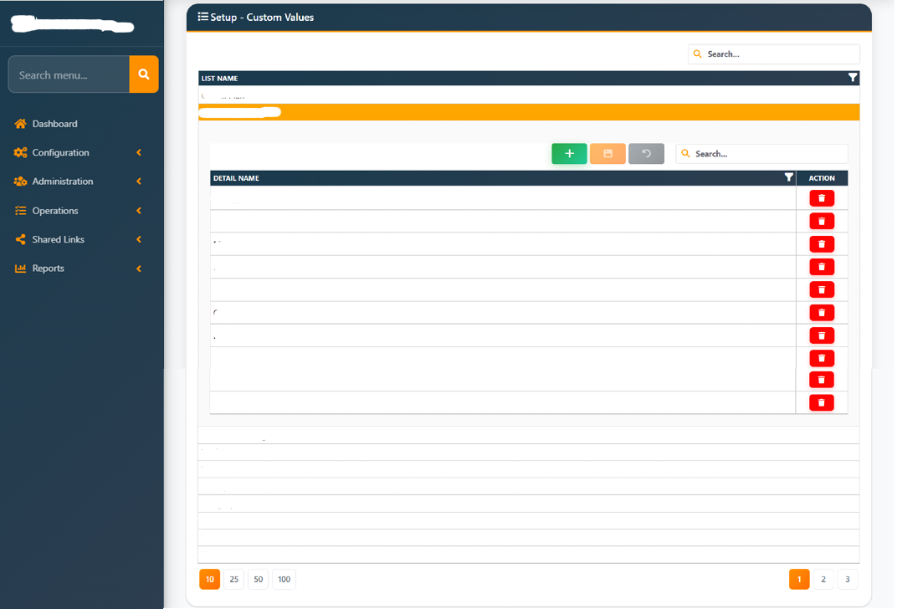

### User List

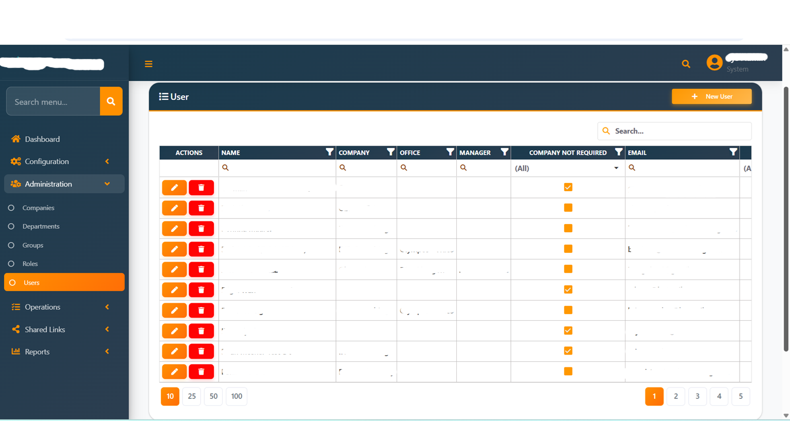

### Incident Activities

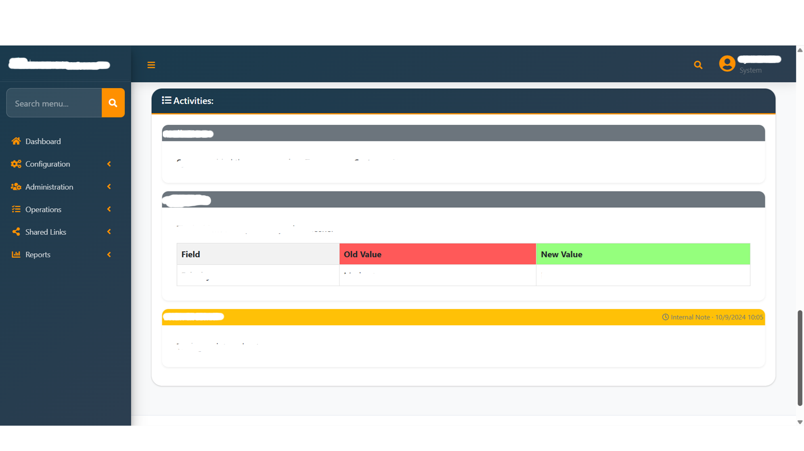

### Incident Notes & Communications

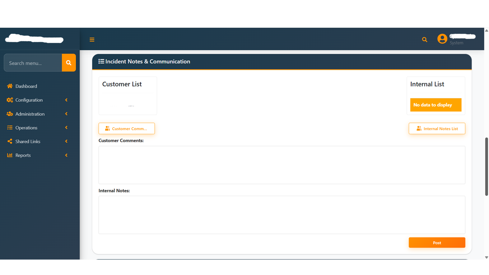

### User Management

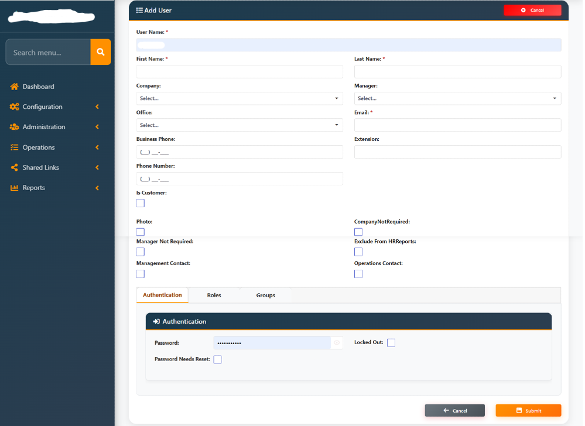

---

## ⭐ Project Highlights

- Enterprise CRM and incident management
- Complex business workflows
- Incident lifecycle management
- Business rule configuration
- User and role management
- Page and permission management
- System administration
- DataGrid-based enterprise interfaces
- Search and filtering
- API-driven application functionality
- SQL Server database integration
- ASP.NET Core backend development
- Consistent enterprise-style UI

---

## 🔐 Portfolio Disclaimer

The screenshots included in this repository are for portfolio demonstration purposes only.

Sensitive, confidential, and personally identifiable information has been masked or removed. No production source code, credentials, connection strings, or confidential client data are included in this repository.
